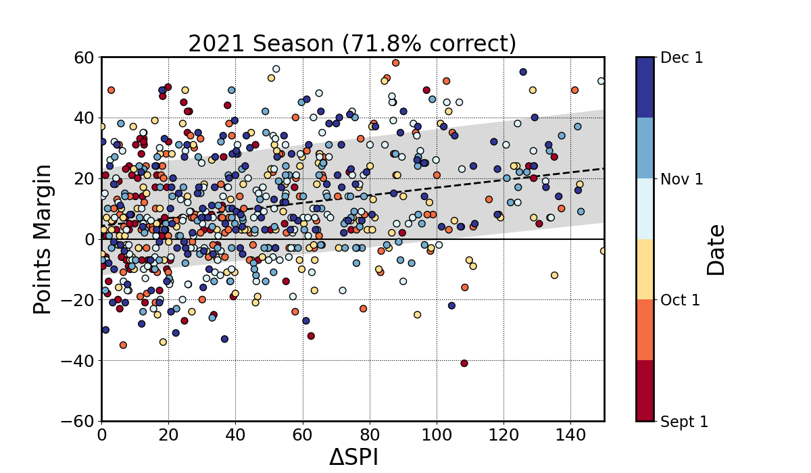

# Sicilian Power Rankings

Welcome to the Sicilian Power Rankings (**SPR**) code repository! Below is a brief introduction, motivation, and description of the algorithm.

## Notes

1. The code (which I initially wrote in my early years of using Python) should be significantly refactored, as there is a lot of room for improvement, optimization, and cleanliness.
2. I haven't updated this project in several years now, and during that time its dependencies have changed such that the code in its current form no longer functions properly.

## Background & Purpose

Division I-A (FBS) college football is perhaps the most difficult sport in which to rank teams, and as a result, unsurprisingly, every ranking system is met with controversy and frustration. Due to the large number of teams (~130) but small number of regular season games for each (~12), as well as the wide variance in programs' resources & player/coaching talent, it is nearly impossible to devise a fair system that doesn't involve wildly subjective metrics (like "the eye test"), particularly for the postseason. As a lifelong football enthusiast and former Division I-A player (thanks to the brief time I spent playing on my beloved Hurricanes football team here at the University of Miami), I set out to create an alternative to subjective rankings.

Here, by formulating my own algorithm and data pulled from the [```SportsReference```](https://pypi.org/project/sportsreference/) Python API, I have given my best attempt at establishing a more objective ranking system for college football teams. The goal is not necessarily to predict the winner of a given game--a task optimized by the [ESPN Football Power Index (FPI)](https://www.espn.com/college-football/fpi)--but rather to assign a merit-based ranking to each team for establishing postseason worthiness.

There should, of course, be a correlation between the relative ranking of two teams in a given game and the winner of that game, so my rankings do correctly predict the winner of a game >70% of the time (as discussed more thoroughly below), falling only a small margin short of FPI's predictive power (~75% accurate over the past 10 seasons; note that when computing these accuracy percentage for both my rankings and ESPN FPI, only FBS vs FBS games are considered). The inspiration I have drawn from ESPN FPI is evident in the metric computed to determine the rankings--a final number with a maximum value of 100 called the Sicilian Power Index (SPI), by which the teams are ranked in order from highest SPI to lowest SPI.

# The Algorithm

## Main Criteria and Description

There are two main criteria for **SPR**: **Strength of Record (SOR)** and **Nature of Gameplay**.

**SOR** is determined using my own methodology and considers the quality of a team's opponents in both its wins and losses, but otherwise does not look further than whether the team won or lost. With SOR, beating a top opponent is equivalent regardless of the final score.

**Nature of Gameplay**, on the other hand, looks at the *nature* of those wins and losses--so, it makes sure beating that top opponent by 35 is more valuable than winning on a last-second field goal.

Together, these two metrics account for both the quality of opponents you won (or lost) against **AND** the level of dominance you displayed in those wins (or level of ineptitude you displayed in those losses), which paints the most comprehensive picture of a team. This is not a new idea, as all rankings seek to do this, including the current CFP Committee-based rankings.

What is notable here, however, is using a mathematical algorithm for both aspects to aggressively minimize the level of subjectivity. For example, rankings such as CFP Committee are often criticized for giving teams high rankings for beating other highly-ranked teams (the same idea as **SOR**)--however, this is a self-perpetuating logical loop, as the other highly-ranked teams were granted that ranking by that same Committee in the first place.

Additionally, the infamous "eye test" is applied by the Committee, which is entirely subjective and causes constant rankings controversy. However, it is undoubtedly an important criteria, since almost any rational person would agree that, if there are two teams with nearly identical SORs, but one of them blows everyone out while the other barely wins most games, the more dominant team should clearly be ranked higher. That's why I use the formulaic **Nature of Gameplay** criteria to more objectively encapsulate this important aspect of rankings.

## SOR

### Defining a notion of "strength" independent of the rankings

The first step of SOR is to protect against the self-perpetuating nature of traditional SOR and SOR-like metrics. This is done by using conference standings and ranking each conference among the other conferences to give an estimated level of strength to each team. A conference's rank is determined based on the total **non-conference** wins and losses of all teams in that conference, which gives that conference's total record vs. other conferences.

One caveat that is somewhat subjective is all Power-5 (P5) conferences are ranked above all non-P5 conferences, regardless of W-L. So, effectively the top 5 is determined by the non-conference W-L of the P5 conferences, and the remaining rankings (6 and beyond) are determined by the non-conference W-L of the other conferences. FBS Independents are considered here as a single non-P5 conference. The strength of a conference is then described on a scale from 0-1 (with **1** being the **strongest**) with equal intervals between conferences.

Teams are then ranked within their own conferences by their in-conference wins and losses, just as in the traditional conference standings (except here, divisions within conferences are entirely ignored). One exception is, once a conference champion is determined, the conference champion is guaranteed the top ranking in its own conference, even if another team manages to have a better in-conference W-L. *Note: Currently this feature is only being implemented for the most recent season (2021), but soon it will be fully available for all past seasons.*

Then, each team's ***relative** strength within their own conference* is described on a scale from 0-1, mimicking the style of the conference strength scale. Finally, a team's ***overall** strength* (hereafter referred to as the **Strength Coefficient**) is found by multiplying the conference's strength by the team's in-conference strength to give a final value, also guaranteed to be between 0-1.

Note that early in the season, when few games have been played, the previous season's conference play is considered. As the season progresses, the previous season carries less and less weight until eventually it is no longer needed. This is inspired by FPI's similar use of the previous season's data.

Also note that while FCS teams are not otherwise considered in the rankings, assigning them an overall strength is required to compute the SOR of any FBS teams that have played an FCS team during the season. Here, I assign an overall strength of exactly zero to all FCS teams.

### Using strength of opponents to compute SOR

We can determine the strength of each team's record by considering the **Strength Coefficient** of each opponent that team has faced, as well as whether the team beat those opponents or not.

For a Win, the team will be credited an amount of points equal to the opponent's Strength Coefficient. Beating the best team in the best conference will give the maximum possible reward (1 point), while beating a bad team in a weak conference will give a minimal reward (~0 points). Similarly, beating an FCS team will give the minimum possible reward (exactly 0 points).

For a Loss, the team will be punished according to the opponent's Strength Coefficient. In this case, the penalty will be the *complement* of the opponent's Strength Coefficient, i.e. ```1 - Opponent's Strength Coefficient``` will be *subtracted* from the team's SOR. Losing to a bad team in a weak conference will therefore give a strong penalty (subtracting nearly 1 point). Losing to an FCS team will give the maximum possible penalty (subtracting exactly 1 point). On the other hand, losing to the best team in the best conference will give no penalty (and losing to a great team in a top conference will also give a near-zero penalty).

The SOR is found by adding up the rewards/penalties from all games played.

## Nature of Gameplay

Strength of Record tells us W-L information and opponent quality in those Wins and Losses. The Nature of Gameplay, on the other hand, is designed to illustrate *how* a team achieved its wins or suffered its losses. For this metric, we have several key stats, all of which are experimental and formulated based on my intuition from playing and watching the game of football for many years. Therefore, it works quite well, but leaves plenty of room for further improvement! We calculate Nature as a raw value for each team, then normalize the scores. The formula for a team's raw Nature score `N_raw` is:

```python
N_raw = A + ( 50.0*( ((TD * 7.0)/P)  - ((TDA * 7.0)/PA) )  + TM/G  )
```
Here, `A` is the average margin, i.e., the average difference between the team's total points scored (`P`) and points allowed (`PA`). This is fairly straightforward and shows how close the team's games are on average, and shows whether they have outscored their opponents collectively.

The next term contains another margin-like stat. It was formulated by iterative trial and error, and attempts to encapsulate how dominant a team is. First, we have the fraction of a team's total points that were scored via touchdowns (`TD`), which is designed to show how dominant the offense is. If a large fraction of their points are scored by TD, that suggests they may be difficult to stop *and* have consistently strong play regardless of field position (as opposed to offenses that crumble in the red zone). Next, we subtract the same ratio for the team's opponents--considering the touchdowns allowed (`TDA`) and points allowed (`PA`). This term, similarly, is designed to describe how strong the team's defense is, where a low fraction would suggest a dominant defense that does not often allow touchdowns.

Lastly, there is the turnover margin--namely, the average turnover margin `TM` per game `G`. The concept here is simple--dominant teams often dominate the turnover battle and should have a high positive turnover margin, whereas weak teams will have a negative margin.

After computing `N_raw` for all teams, the Nature scores are normalized to give the adjusted Nature score `N_adj` such that they have a maximum value of 1.0 to resemble SOR.

## Putting it all together

Once every team has a SOR and `N_adj`, the scores are weighted and combined to give the final stat--the Sicilian Power Index (SPI). Again, the weighting was determined by iterative trial and error, and absolutely has room for future investigation. The current weights are 65% for SOR and 35% for Nature. Qualitatively, this reflects that teams with a high SOR (i.e., who have high-quality wins from conquering a challenging schedule) and moderate Nature (i.e., teams who were moderately dominant in those challenging wins) appear to have an edge over teams with a moderate SOR (i.e., teams who beat decent competition) with high Nature scores (i.e., teams who completely dominated their mediocre schedule). A familiar example is the phenomenon of Pac-12 teams (like Washington or Oregon) or Notre Dame dominating their mediocre competition (moderate SOR, high Nature), then getting blown out in the CFP (by Alabama, Clemson, etc.) who had higher SOR. This is a very heuristic description, and I intend to investigate the specifics of the weighting much further.

To apply the weights, SOR for every team is multiplied by 65, and Nature for every team is multiplied by 35, then they are added up to give the team's final score, the **SPI**, which has a maximum possible value of 100. From there, teams are ranked based on the value of their SPI, which yields the rankings--**SPR**.

## Evaluation

As mentioned, the goal of these rankings are not to predict winners of individual games--ESPN FPI is your stat if that's what you're interested in. The goal here is to put forth my best attempt at resume-based and achievement-oriented rankings. It therefore gives the "top" or "most accomplished" teams, rather than the "best" teams (since, as discussed extensively before, how could you ever know who the "best" teams actually are since each team only plays ~10% of the competition--the answer to that is you try to do the "eye test" which is the bane of my rankings philosophy due to its awful vulnerability to subjectivity).

However, while "most accomplished" isn't the exact same thing as "best," the two concepts should **without a doubt be correlated**. So, while I would never expect the Sicilian Power Rankings to match ESPN FPI's ~75% accuracy, I do expect it should be close. So, below I have shown the results of applying the Sicilian Power Rankings to the 2021 college football season. In particular, for every game played, I have plotted the difference in Sicilian Power Index (Delta SPI) between the higher-ranked team and its opponent on the horizontal axis, and the margin of the outcome (relative to the higher-ranked team). Also plotted are percentile lines--the dotted line is the 50th percentile (i.e., it cuts the points y-values exactly in half), while the gray shaded region fills between the points' y-values +/- 1 sigma percentiles (84th and 16th percentiles, respectively).

As shown, while the plot itself is highly scattered, SPI was ~72% effective at predicting the winners of the games. This is highly statistically significant (nearly 9 sigma), and is very close to the ~75% that ESPN FPI has reached across the past 10 years. This is a powerful reinforcer of the ranking algorithm because it shows a strong relationship between the winners of games and their rankings. Also, the percentile lines show that, while the points are scattered, the prediction accuracy increases as the SPI gap increases, which further reinforces the ranking method.

Far more investigation on this topic is underway. For example, by visual inspection it is clear from the color scale (which indicates the date the game was played) that my rankings are successful at predicting the winners at all stages of the season, even early on when much of the SOR is based on the previous season (a trait shared by ESPN FPI), so I will soon be looking into the details on what impact (if any) time has on the prediction accuracy. Moreover, given the sparse data from the pandemic-limited 2020 season, it is surprising how well my rankings performed at the beginning of 2021. Therefore I am also working on performing the same analysis on all past seasons.



## Running the code

After cloning the repository, to generate current rankings, run

```bash
$ python cfb_full_rankings.py
```

To generate rankings at any given date in the past, before running the code you can change the environment variable ```DATE_STRING``` to a ```datetime```-compatible string of your choice. For example, this can be done from ```python``` using

```python
# Pick any valid year, month, and day strings
os.environ["DATE_STRING"] = str(datetime(year, month, day, 0, 0, 0, 0))
```

or the ```bash``` command line using the following (with an arbitrary past date shown)

```bash
$ export DATETIME_STRING="2019-11-30"
```

*Note: this is only compatible with seasons 2001-Present due to lack of data in the 1990s and prior available on the ```SportsReference``` database.*
